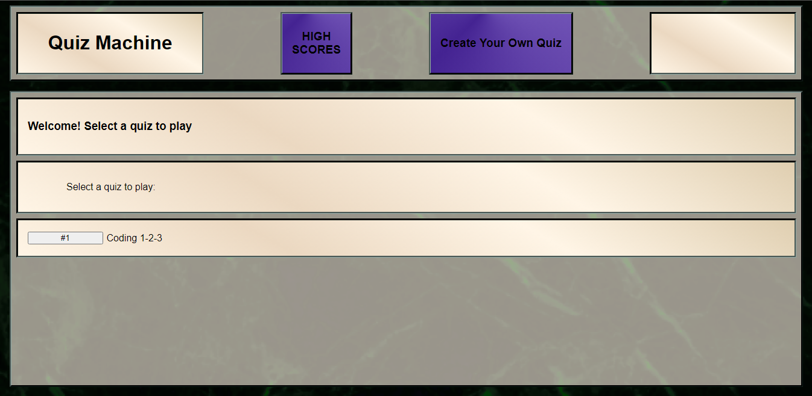

## WELCOME:
This is the README.md for the Challenge Four "Quiz API" for the UT Coding Bootcamp.

This is a from-scratch website that lets you take a timed quiz.

## CODING 1 - 2 -3
The only quiz available on Quiz Machine is 'Coding 1 - 2 - 3'

You have 30 seconds to answer 10 questions.

Answer carefuly, a wrong answer choice will lose you a second and you cannot go back!

If you run out of time, the quiz is over. If you answer all the question, the quiz is over.

Either way, you'll have the opportunity to submit your highscore at the end of the quiz!

## DEBUG:

These shortcuts are available:

alt + p : stops the timer

alt + m : returns to mainmenu

atl + ~ : loads debug quiz (answers are all set to #1 for quick points)

## HOW TO:
Click the button for Coding 1-2-3 to launch the quiz!

Click the High Score button to see your scores.

The 'Create Your Own Quiz' feature is currently removed. The button only takes you to an empty page.

## VISIT:

[Click here](https://lawhornmatt.github.io/TakeThisQuiz/) to launch Quiz Machine and take a quick coding challenge!

## SCREENSHOT:

## CREDIT:
Matthew Lawhorn, July 2022
